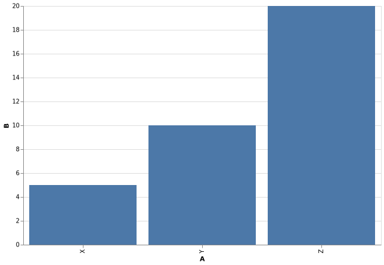
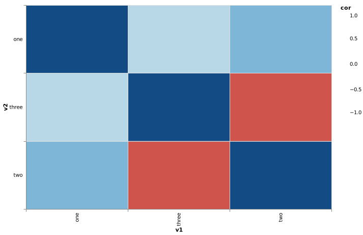
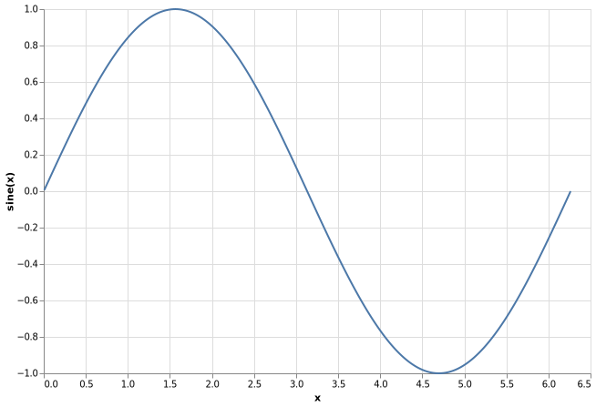

# Examples

## Bar chart
```
View Chart.Bar'AB'⍪'XYZ',⍪5 10 20
```



## Box plot
```
View Chart.BoxPlot Example.Data.penguin
```

## Correlation heat map
```
View Chart.HeatMapCorrelation Example.Data.corrMat
```



## Line graph
```
x←(÷×(○2×⍳))1000   ⍝ 1000 number from 0 to 2×pi
y←1○x              ⍝ sine(x)
data←'x' 'sine(x)'⍪x,⍪y
View Chart.Line data
```



## Pie chart
```
total←Example.Data.(barley[;2],∘(+/)⌸barley[;4])
View Chart.Pie ⌽total
```

## Scatter plot
```
View Chart.Scatter Example.Data.car[;4 8]
```
